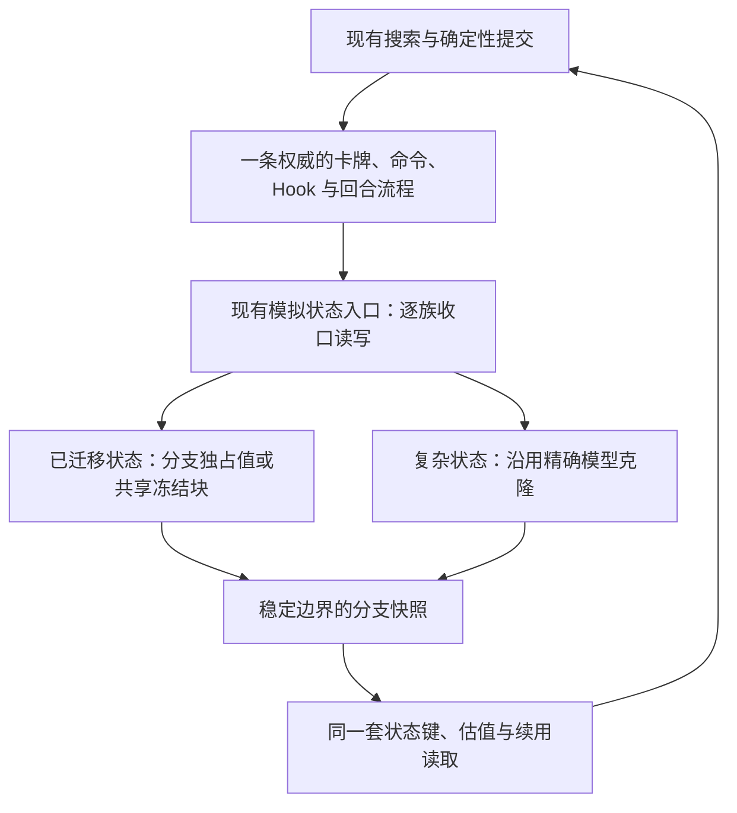

# CombatSolver 模拟器架构与长期维护成本研究

最新的小改动优先级与直接测量见[局部字段与数据结构研究](simulation-data-layout-20260912.md)。本篇保留长期架构比较；当前先研究辅助计数表与容器包装，未启动状态族迁移。

**建议停止把“完整迁移所有战斗效果”作为当前性能工作的交付目标。** 现有 Compact 后端可以保留为已证明封闭场景的专用执行器，但逐项补齐它的卡牌、Power、遗物、怪物、选牌和回合逻辑，会持续增加语义同步与组合验证成本。按完整子搜索选择后端能减少转换，却不能消除两套执行流程的长期维护；共享简单出牌配方也只能解决其中一部分。

更适合当前项目的长期方向，是**保留一条权威战斗执行流程，按真实热点逐步替换它保存和复制状态的方式**。每迁移一个状态族，原有卡牌和 Hook 应通过同一套受控读写入口继续执行，旧权威存储在该范围内随之删除。尚未迁移的复杂模型继续采用当前精确克隆协议，不要求先把全部游戏规则翻译成第二套指令。

这是一项架构取舍，而不是已验证的加速方案。现有证据没有证明存在“少量修改、低维护成本、全场景两倍提速”的路径；同样，也没有依据给完整迁移承诺几周、几个月或固定 token 数。眼下最经济的选择，是保留已有收益，限制新增后端范围，只给能独立证明价值的优化投入下一批工作。

## 1. 证据范围与现状

源码基线为任务分支 `2f5a6df`，已合并上游 0.36.4。本报告引用截至 2026-09-12 的本地源码、已有性能与差分记录，以及外部项目的一手设计资料。历史性能记录对应不同提交、输入和运行模式；本报告没有新增游戏基准，也不把静态检查写成行为或性能验证。[^1]

前期确实做过深入剖析。2026-09-10 的两场完整搜索，CPU 互斥分类已经分别覆盖回合推进、快照估值、手动出牌和状态分叉；后续又对局部方案做了进入或撤回决策。问题不在于缺少性能研究，而在于局部优化收益有限后，工作逐渐转向了具有独立语义和状态机的新后端。[^2][^3]

| 当前事实 | 对决策的含义 |
|---|---|
| Compact 核心与适配目录合计 31 个 C# 文件、4,968 行；包含回合、Power、怪物和恢复流程 | 已经承担第二套模拟执行器的职责，不能按“替换几个集合”估算成本 |
| 当前编译器列出 67 种卡牌类型 | 表示类型表规模，不能换算完整战斗支持率或性能覆盖率 |
| 复杂亡灵输入的 28 种根卡牌类型均已在这张表中 | 继续补普通根卡牌未必能解锁目标场景；遗物、怪物、药水和生成池仍是独立边界 |
| 历史严格出牌配方目录中有 77 种，其中 68 种未进当前 Compact 类型表 | 有自动复用候选，但目录较旧，且 OnPlay 可推断不代表整张牌及其环境可准入 |

这些计数来自同日源码与覆盖目录交叉审计，完整方法和限制见本地审计记录。分支相对上游的约 24.9 万新增行大部分是文档、证据和工具内容，不能全部算成引擎代码；与此同时，约 5 千行 Compact 核心和适配代码仍代表真实维护范围。[^1]

## 2. 维护成本主要来自哪里

### 2.1 语义副本与组合边界

游戏里一次攻击可能涉及费用、出牌历史、伤害修正、格挡、受伤后 Hook、Power 移除、死亡、召唤、自动出牌和挂起选择。旧引擎把这些步骤分布在命令、镜像和领域补偿中；Compact 则在自己的程序、阶段和布局中实现支持范围内的对应行为。维护压力主要来自这些规则与时序需要持续保持一致，而不只是单张牌的几行效果代码。[^4]

| 上游或本地变化 | 两套独立执行器需要关注的范围 | 单一执行流程仍需承担的工作 |
|---|---|---|
| 普通伤害数值或目标规则变化 | 旧镜像、Compact 编译绑定，以及两边的相关边界 | 修改一处权威规则，检查共享读取与公式 |
| Power 在某个 Hook 前后更新内部计数 | 两套生命周期、各自保存字段、暂停与恢复顺序 | 一套生命周期，加该状态族的完整存储合同 |
| 新增会跨回合影响未来行为的字段 | 两种状态表示、桥接、键、续用和差分 | 一个权威字段及其键、续用、差分声明 |
| 原生或第三方克隆协议改变 | 旧克隆与 Compact 捕获/准入/物化边界 | 当前精确模型路径及相关访问边界 |
| 搜索读取新增一个特征 | 两种表示的读取与物化回退 | 单一语义读取，必要时派生缓存 |

右列也不是“只改一个文件”。身份、分叉、状态键、跨回合续用和原生差分本来就是模拟正确性所需的工作。可减少的是重复维护同一规则、同一字段和两者之间的同步，而不是删掉必要的正确性合同。

### 2.2 最近两批提交显示了实际扩散范围

`041f6dd` 的简单 Doom/Vulnerable 卡牌批次，涉及 3 个生产文件和 3 个测试文件，源码统计为新增 539 行、删除 12 行；`7f7dc98` 的 Soul 生成卡批次，涉及 6 个生产文件和 2 个测试文件，新增 606 行、删除 26 行。后者跨越效果程序、怪物/回合相关执行、旧效果补偿、编译器和投影适配。这里的行数包含测试，并不代表这些新增行都属于生产复杂度。[^5]

这些例子不足以推算每张卡的平均工时，但足以说明：当前补齐工作的单位往往是一段跨层行为链。降低成本应先减少这种同步范围，再考虑批量生成多少卡牌代码。

### 2.3 混合执行会再增加转换合同

当前 `CompactDiscardProjection.Materialize` 要求候选已完成且属于同一根，然后从根分叉旧模拟器，并扫描候选的全部事件来恢复兼容对象图。这不是把数组强制转换成对象视图，也不是一个已经验证可以任意双向使用的状态交换协议。[^6]

历史接入过程提供了明确反例：在同一场完整搜索的早期候选中，旧版 12.772 秒、候选 39.934 秒，同时记录了 74,683 次兼容物化。后来补齐读取、挂起选择和续用接线，物化才降为零，并在普通 GC 的直接 coordinator 样本中出现约两倍结果。两次之间改变了多个边界，不能把全部时间差单独归因于物化，但它说明桥接成本足以抵消内核收益。[^7]

因此，“每张牌选最快后端”“每次 EndTurn 回旧引擎”都不是低成本拼接。EndTurn 在大量搜索父节点上被尝试，其次数远多于最终路线的回合数；只按最终八回合估算八次转换，会严重低估执行量。[^1]

## 3. 外部设计能借鉴什么

### 3.1 MuJoCo：分开模型、必要状态与工作区

MuJoCo 官方文档将模型描述、模拟状态和线程工作区明确分开；并指出，复制必要输入后重算派生量，可能比复制全部工作缓冲更快。精确复现仍须包含影响后续执行的状态，包括相关 warmstart 或插件状态。[^8]

对 CombatSolver 的启示是一个存储边界：节点应保留恢复后续行为所需的状态，临时计算对象可以由 worker 独占并复用。这个原则并不要求把卡牌和 Hook 再实现一次，也不意味着当前所有对象都能安全共享。

两者的差异很大。CombatSolver 的可变状态分散在影子对象、克隆模型、隐藏状态、监听器和历史中，还存在对象身份与挂起选择；MuJoCo 的统一状态接口不能直接搬来当现成后端。这里借鉴的是所有权设计，不引用它的性能倍率来预测本项目。

### 3.2 Stockfish 与 OpenSpiel：撤销是完整合同，不是免费能力

Stockfish 的 `do_move` 保存恢复所需的 `StateInfo`，`undo_move` 恢复局面；其状态声明还区分需要复制和将重新计算的字段。[^9] OpenSpiel 的 `Child` 则使用 Clone 后 ApplyAction；快速 UndoAction 是可选能力，默认实现会显式报错。[^10]

这两种一手实现共同说明，克隆和撤销都是合理工具，选择取决于状态与搜索方式。对本项目而言，撤销必须覆盖牌序、RNG、监听身份、事件、隐藏计数和挂起局部状态；不能只记录生命值和能量就替换现有 Fork。

当前 Beam 还要同时保留许多候选，局部 worker 的撤销不能消除所有持久快照。一个近似内存模型是：`保留候选数 × 必要状态大小 + worker 数 × 工作区大小 + 共享根与派生元数据`。缩小工作区与缩小保留节点是不同优化，需要分别测量。

### 3.3 Truffle：自动获得优化执行器需要适合编译的语义输入

Truffle 提供基于解释器的语言实现框架，配合 Graal 优化；其文档明确讨论部分求值、无法内联的调用以及退优化回解释器。[^11] 这支持“从同一语义来源生成快路径”的方向，但也表明优化器需要明确的解释器结构和退出协议。

现有 C# 镜像、游戏对象、反射、委托、原生调用和选牌挂起，不会因为增加一个编译步骤就自动成为这种输入。为本项目建立通用 C#/IL 部分求值器，会引入新的编译器工程；它不能作为降低当前迁移成本的短期方案。

### 3.4 Roslyn：适合生成重复映射，不负责推导游戏规则

Roslyn 的源生成器可以检查输入并向编译加入新源码；官方设计明确其不能直接修改已有用户源码。[^12] 它适合在已有明确字段描述后生成部分保存、恢复、比较或登记代码。

哪些字段影响未来、某个计数应在抽牌前还是抽牌后更新、两个同类型 Power 是否代表同一实例，仍须由领域规则决定。生成器可以减少漏抄与机械重复，不能自动提供正确语义。当前应优先复用已有覆盖目录与数据描述，只有重复映射确实成为维护负担时再引入生成步骤。

## 4. 推荐的架构边界

推荐方向是让当前模拟器逐步获得紧凑状态能力。这里的“逐步”按状态族和读写闭包划分，不按一张张卡牌重新建立全游戏支持表。

图中的状态入口应落在现有具体类型与窄接口中，不要求新增 DI 容器、通用 ECS 或一层只负责转发的 facade。紧凑值与复杂模型可以共存，但**同一个分支字段只能有一个可写权威来源**。例如迁移 Power 数量时，不能一边允许 `PowerModel._amount` 独立变化，一边再维护另一份槽位数量，靠每个动作结束时互相同步。

### 4.1 当前已经具备的基础

`SimCreatureState` 已持有 `CreatureVitals`，生命值和格挡运算转交给同一个值类型；旧命令与生命周期仍继续执行。这是现成的单一算术来源，但每个生物影子对象仍有分支所有权，不能把共享值类型等同于消除了对象分叉。[^13]

`PredictedCard` 已将 Preview 存储共享，在需要 `MutablePreview` 时克隆；它还保留牌堆归属、变更观察者和外部附着模型隔离标志。许多 `SimulatedCombatState` 集合本来也使用 COW。普通“给集合加 COW”不是新的总体优化方向，必须先找仍然发生且能安全取消的复制。[^14]

现有 Compact 的冻结值、工作区、纯值计算和严格差分资料，也可以作为未来存储改进的基础。但不能直接把整套 `ResumableDiscardProgram` 接在旧命令下面：它同时拥有大量独立时序和特定状态布局，需按实际能消除重复的组件提取。

### 4.2 真正困难的边界：可变对象借用

`PredictionStateStore.GetReadOnly` 返回的仍是可变状态对象，而且缺失时会创建并插入；`TryGetReadOnly`、`ReadEntries` 也没有通过类型系统保证对象不可写。`PowerAmountPredictionState` 就有可写 Amount 与递减、清空方法。只让底层字典共享，无法阻止已取出的引用在兄弟分支间发生写入污染。[^15]

Power 的障碍更大。当前 Fork 会克隆实际模型并用同一个 `PredictionForkContext` 重映射监听引用；部分镜像还能调用原模型方法。只增加一个读写适配层，不能自动拦截所有原生属性、私有字段和已捕获引用。[^16]

因此每个被选中的状态族都要满足：

1. 能列清所有影响分支的字段、对象引用和读写路径，包括模型方法内部的访问。
2. 写入前取得该分支的可写所有权；只读入口不暴露可逃逸的可变内部对象。
3. 保持同一实例身份和监听顺序；前一个 Hook 改变后一个实例时，后续读取必须看到正确值。
4. Fork、状态键、续用和差分读到同一来源；新增字段必须明确各自参与范围。
5. 完成该族替换后，删除旧权威字段或旧写路径；有遗留绕过时继续精确克隆，不假装迁移完成。

这是有边界的状态重构，不是无成本替换。若一个族需要改写大量效果才能封闭读写，而当前热点收益不足，就不应进入实现。

### 4.3 工作区复用需要与节点寿命分开

worker 可以重复使用临时缓冲，但已发布候选不能持有下一次作业会修改的缓冲引用。跨节点保存的是冻结状态或有明确所有权的对象；槽位代次、容器长度和新增实例身份也属于恢复合同。原有固定 lane、原序提交、候选释放和取消排空应继续保持。

选牌挂起尤其不能顺带重写。当前旧引擎通过明确边界与回放处理选择，不保存任意可恢复调用栈；在状态存储改进中，只沿用已经允许 Fork 的稳定边界。通用 continuation 是另一项工程，不能把它藏在“更换状态容器”这一批里。[^17]

## 5. 对几种迁移方案的重新排序

下面的成本等级是基于当前代码结构的相对判断，不是工时估计。

| 方案 | 初始改动 | 长期维护 | 性能与适用范围 | 决策 |
|---|---|---|---|---|
| 继续在旧引擎内做有证据的局部优化 | 低至中 | 较低 | 范围广，但多数剩余微优化空间有限 | 当前主线 |
| 按热点状态族替换存储，保持同一执行流程 | 中；某些族很高 | 成功删除旧路径后较低 | 有分配与局部计算潜力，尚无总体收益证明 | 长期方向，按收益逐批进入 |
| 现有 Compact 保留少数封闭场景 | 已有投入；新增边界有成本 | 中 | 可保存已经获得的结果，覆盖受限 | 可以保留，控制范围 |
| 按完整子搜索选择 Compact/旧引擎 | 低至中 | 中 | 避免节点间转换，但仍要支持整段可达效果 | 作为局部试验，不作为全面迁移策略 |
| 从同一严格配方生成简单 Compact 程序 | 中 | 简单效果较低，完整时序仍高 | 能减少手写牌表，不能自动补齐 Hook/生命周期 | 条件性辅助工具 |
| 每张牌或每回合双向转换 | 高 | 高 | 转换成本可能吞掉内核收益 | 不建议 |
| 通用 IL 编译、全引擎撤销、全面 ECS 改造 | 很高 | 新增基础设施长期负担 | 现有证据无法证明回报 | 当前不进入 |

### 5.1 部分接入仍有价值，但需要封顶

现有 coordinator 已按无药、用药约束创建独立 solver，因此可以研究“其余条件已闭合、只携带一瓶已证明无被动作用药水”的无药子搜索。主线程冻结完整槽位状态后，该子搜索可尝试 Compact；用药子搜索继续从原始根运行旧引擎。这样不需要逐节点换表示。[^1]

这个切口要保留状态键、续用、固定前缀和自动触发语义。“禁止主动用药”不等于药水不会自动触发。它也不能单独解决复杂亡灵的未知遗物、怪物和生成池，因此只值得用一个已闭合场景证明适用范围与净收益。

将来如果支持域长期不再扩大，维护专用执行器可以接受；每次上游升级至少要证明其入口仍然满足能力条件。若连续多次升级都迫使两边同步修复核心时序，而实际使用覆盖率很低，就应考虑停用或退役该专用路径，保留其已合并到公共层的改进与测试。

### 5.2 共享配方不应升级成另一场重写

当前 `CardEffectRecipe` 只表示 Attack、Block、OwnerDrawOne、OwnerDrawCards 的顺序组合，旧执行器调用已有通用镜像，遇到选择挂起便返回。`InferStrict` 能把已证明的 OnPlay 形状归入这些组合。[^18]

将严格分析结果公开为数据，供旧执行与 Compact 编译消费，可以减少手写简单卡牌映射；这是合理的局部复用。但效果数值、目标、动态变量、被动 Hook、历史、费用和选择后续仍需完整合同。77 种旧配方不能直接宣称为 77 种新增 Compact 支持。

如果未来为了迁完全部卡牌，把所有复杂效果都先重写成新的通用配方语言，工作又会回到完整语义迁移。只有当配方能替代两处现存重复、且无需扩建一套大语言时，才应引入对应操作。

## 6. 性能收益应如何估计

### 6.1 原始剖析已限制了“小改动大提速”的空间

历史完整搜索中，Fork 占请求互斥 CPU 的 14.52% / 13.75%，Snapshot 占 28.25% / 24.43%。在假设工作量、其他成本和并行行为不变的简化模型中，把全部 Fork 成本减半只对应约 1.08× / 1.07×；把全部 Snapshot 成本减半对应约 1.16× / 1.14×。这些是依据旧分布的敏感性计算，不是当前版本墙钟预测。[^2]

同一剖析里，亡灵 `PredictionStateStore.Fork` 仅占 Fork CPU 的 4.00%。换算为请求 CPU 约 `14.52% × 4.00% = 0.58%`；即使假设这一段完全免费，模型也只有约 1.006×。所以“全面重做通用状态仓库”没有现成的大幅提速依据。

另一次保留 P5 后的专项采样显示，三类 Power 的 Fork scope 合计约 2.70% 请求 CPU、约 3.44 GB 分配，最终没有进入存储迁移。该 scope 包含测量和映射开销，不能全当成可消除成本；不同轮次的 CPU 分母也不同，不能与前一段简单拼接。[^3]

### 6.2 状态更紧凑不保证计算更快

共享 `CreatureVitals` 的历史完整原输入对照中，最终机甲耗时约 +2.02%、亡灵约 −1.39%，worker 分配仅约 −0.523% / −0.422%；样本有限且受 GC 波动影响，原记录明确没有将它算作总体提速。这直接约束了“共享纯值就能解决性能”的乐观判断。[^13]

当前有意义的 Compact 历史证据如下：

| 运行条件与范围 | 时间 | 内存口径 | 可以得出的结论 |
|---|---|---|---|
| 已闭合机甲场景，普通 GC、直接 coordinator 单次样本 | 约 2× | 同时减少大量分配 | 在这一条件下有潜力，不能外推所有场景 |
| 已闭合机甲场景，Runtime / NoGC，新进程首次搜索 | 7.209 → 7.164 秒 | worker 累计分配 5.654 → 2.976 GB，约 −47.36%；结果时工作集 7.164 → 4.454 GB，约 −37.83% | 时间基本持平，分配明显减少；结果工作集不是峰值 |
| 复杂亡灵原输入 | 未形成对应的完整 Compact 对照 | 无可外推数字 | 不承诺覆盖后仍有相同倍率 |

前两行来自不同实验口径，不构成互相矛盾的结果。它们更支持“降低分配压力是重要价值”，而不是“新内核已经普遍快两倍”。[^7][^19]

### 6.3 部分覆盖必须按实际成本加权

若快路径替换旧总时间的比例为 `f`，该部分提速 `s` 倍，新增捕获/转换等开销为旧总时间的 `c`，简化总体倍率为：

`1 / ((1 − f) + f / s + c)`

例如假设快路径 2×、额外开销为旧总时间的 5%，覆盖旧耗时 25% / 50% / 75% 时，总体分别约 1.08× / 1.25× / 1.48×。这是演示，不是预测。卡牌类型数、转移数量、CPU 时间和分配字节的覆盖率各不相同，不能互相替代。[^1]

### 6.4 低维护成本的内存路线值得优先保留

已有 Runtime 内存压力实验没有改写战斗效果。在一个固定工作量、DOP4、NoGC 4 GB 的历史亡灵样本中，两种软阈值相对关闭策略，峰值驻留内存降低约 20.4% / 29.5%，耗时增加约 14.9% / 6.5%。每个阈值只有单个冷进程样本，实验已撤回，不能直接照搬阈值。[^20]

它说明，若首先要缓解高内存与长时间游戏卡顿，Runtime 回收时机和搜索状态寿命可能比迁移全套效果更经济。后续仍需按真实 NoGC 周期归属计量，检查跨请求复用和层级超调，并在正常可见 Steam 会话验证；这不是无代价省内存，也不是一次强制 Full GC 的建议。

## 7. 可控制成本的下一步

### 7.1 当前决策

保留已经通过验证的旧引擎优化、公共纯值组件、正确性修复和测试。Compact 的现有闭合域可以继续存在，但暂停以“再补一批卡、直到全游戏迁完”为推进方式。不要为了回到旧方向而整批回滚分支：其中包含独立有价值的修复与基础设施。

当前最合理的工作单位是**一个能独立交付、独立失败退出的实验**，而不是完整迁移路线。存储改进和无药子搜索扩域可以分别评估，不能把两者及通用配方、撤销、continuation 合成同一个大改造。

### 7.2 若进入下一批性能实现

首先复用已有数据排除明确低收益方案；上游版本和 GC 行为已有变化，只在确实需要决定实现目标时补一轮当前基线。基线要能区分请求时间、worker CPU、累计分配、存活状态和峰值驻留量，并记录固定搜索工作量。对保留旧游戏规则的优化，应优先在复杂亡灵原输入上判断是否有价值，而不是重新缩成容易闭合的小战斗。

首个实验优先从内存生命周期或一个真正高成本的派生读取组件中选一项。若选择状态族，则先确认该族自身的成本、读写覆盖和克隆比例；没有足够空间时停在调查结论，不因为“数组设计很整齐”继续迁移。旧数据已否决的小型 StateStore、三类 Power COW、普通卡牌缓存等，不应没有新证据就重做。

建议以固定工作量下约 10% 的稳定时间改善，或约 20% 的峰值内存改善且时间代价可接受，作为是否值得扩大投入的参考门槛。这是成本控制建议，并非既定目标、已有结果或对性能的承诺。若单批收益较小但明确删除了长期重复维护，可以按可核验的维护收益评估，而不伪称大幅加速。

### 7.3 每批迁移需要证明的最小内容

| 维度 | 必需证据 | 可复用的既有能力 |
|---|---|---|
| 规则等价 | 受影响效果与风险交互的原生/模拟严格差分 | 现有差分与 fixture 框架 |
| 分支隔离 | 父、兄弟、冻结候选互不污染；引用身份正确 | Fork 合同及多 worker 测试 |
| 搜索等价 | 原状态键、动作顺序、完整结果与固定工作量 | 已有同工作量对照 |
| 生命周期 | 相关选择、跨回合、取消、释放边界 | 已有对应协议与测试，不扩大无关组合 |
| 净收益 | 包含捕获、冻结、恢复、派生读取和释放成本 | headless 快速交错 A/B；最终可见 Steam 口径 |
| 维护收敛 | 指明删除了哪份旧存储、重复语义或双写 | 源码差异与现有结构门禁 |

多个简单效果可以参数化批量差分，复杂边界使用少量手写风险场景；不要求每张牌复制一整套测试框架和长报告。源码或输入未变时，已通过的证据应直接复用。原生差分仍应保留，因为新旧后端可能共享同一个错误，二者相等不能代替对游戏行为的核对。

### 7.4 维护成本的可观测指标

不建议用“已迁移卡牌百分比”管理这项工作。更有用的是：一次规则变化要手工同步几处权威实现；每批删除了多少旧写入口；新增状态是否只描述一次；哪些测试由同一输入生成；专用后端实际承担多少 CPU 与分配；上游升级需要修复多少独立时序副本。

这些指标可以控制投入，仍不能直接换算 token。复杂交互、失败诊断和实际性能结果决定迭代次数。可靠的承诺应是每批结束时留下可验证的收益或明确的不进入结论，而不是承诺把所有模拟规则重新实现完。

## 8. 决策边界与尚未证明的部分

**维护成本风险：证据充分。** 当前补齐会跨越多层代码，双执行器还会增加同步与桥接合同。按子搜索隔离和共享简单配方能减轻部分工作，不能消除完整语义副本。

**推荐架构方向：有代码基础，属于工程判断。** 一条权威执行流程、逐族替换状态存储，能从结构上减少未来规则重复；但可变模型借用和原生调用使其无法一次透明完成。架构优雅不等于有值得实施的性能收益。

**大幅提速与总体省内存：仍需当前实测。** 历史 Compact 数据证明了特定封闭场景的分配潜力；旧引擎的 Runtime 内存策略也提供了另一条有代价但范围更广的路径。没有证据支持全场景两倍、确定峰值降幅或完整迁移期限。

**交付目标应是可维护的净收益。** 全面迁移可以一直不完成，甚至不再作为目标；只要现有引擎继续正确、有限快路径持续有收益、公共层重复逐步减少，就已经满足性能工作的实际目的。

## 来源

本地源码均按 `2f5a6df` 阅读；历史记录保留各自提交、日期、样本与运行条件。外部滚动文档与 master/main 源码访问于 2026-09-12，其用途是验证设计机制，不用于预测本项目性能。

[^1]: CombatSolver，2026-09-12 基于 `2f5a6df` 的[静态交叉审计数据](simulation-hybrid-audit-20260912.json)，并核对 [Compact 编译器](../../src/Prediction/Compact/CompactCardProgramCompiler.cs)、[搜索协调器](../../src/Search/CombatSearchCoordinator.cs)与[后端选择](../../src/Runtime/SearchBackendPolicy.cs)。审计使用历史覆盖目录及原始生成池记录，类型计数不代表新行为验证；JSON 中的 `.local` 字段仅记录历史原始材料来源，不是可下载链接。
[^2]: CombatSolver，[极高配置完整搜索的模拟热点](simulation-profile-20260910.md)，2026-09-10，互斥 CPU、Fork 子项与分配口径。
[^3]: CombatSolver，[P2 / P4：剩余候选的进入决策](simulation-refactor-p2-p4-decision-20260910.md)，2026-09-10，含专项采样分母、Power 借用与时序限制；[方案决策账本](simulation-strategy-ledger-20260911.md)，历史阶段结论，当前状态以源码和较新记录为准。
[^4]: CombatSolver，[原模拟器源码目录](../../src/Engine/InCombat/Simulation)、[Compact Power 阶段](../../src/Engine/InCombat/Simulation/Compact/ResumableDiscardProgram.PowerPhases.cs)、[Compact 回合阶段](../../src/Engine/InCombat/Simulation/Compact/ResumableDiscardProgram.Rounds.cs)。
[^5]: CombatSolver 本地 Git 提交 `041f6dd`（`perf(simulation): admit simple Doom and Vulnerable cards`）与 `7f7dc98`（`perf(simulation): admit Soul-generating Necrobinder cards`），2026-09-11；按 `git show --stat -- src` 的源码范围统计，未计文档与覆盖目录。生产/测试文件按 `src/Testing` 区分。
[^6]: CombatSolver，[CompactDiscardProjection.Materialize](../../src/Prediction/Compact/CompactDiscardProjection.cs#L471)，同根与 Complete 检查、根 Fork 及全事件扫描。
[^7]: CombatSolver，[紧凑搜索后端接入记录](simulation-search-backend-20260911.md)及[结构化结果](simulation-search-backend-20260911.json)，2026-09-11，普通 GC / coordinator 口径。
[^8]: Google DeepMind，MuJoCo Documentation，[Simulation：State and control / Multi-threading](https://mujoco.readthedocs.io/en/stable/programming/simulation.html#state-and-control)，滚动 stable 文档。必要输入状态、派生工作量与每线程数据的区别。
[^9]: Stockfish developers，[position.cpp](https://raw.githubusercontent.com/official-stockfish/Stockfish/master/src/position.cpp) 的 `do_move` / `undo_move`，以及 [position.h](https://raw.githubusercontent.com/official-stockfish/Stockfish/master/src/position.h) 的 `StateInfo`；master 源码，2026 年版权版本。
[^10]: Google DeepMind，OpenSpiel，[spiel.h](https://raw.githubusercontent.com/google-deepmind/open_spiel/master/open_spiel/spiel.h)，`State::Clone`、`Child` 与 `UndoAction`；master 源码。
[^11]: Oracle / GraalVM，[Truffle Language Implementation Framework](https://www.graalvm.org/latest/graalvm-as-a-platform/language-implementation-framework/) 与 [Optimizing Truffle Interpreters](https://www.graalvm.org/latest/graalvm-as-a-platform/language-implementation-framework/Optimizing/)，滚动 latest 文档，解释器框架、部分求值和退优化机制。
[^12]: Microsoft / .NET，[Roslyn Source Generators 设计](https://raw.githubusercontent.com/dotnet/roslyn/main/docs/features/source-generators.md)，main 分支，生成器的 additive-only 约束；[.NET Compiler Platform SDK](https://learn.microsoft.com/en-us/dotnet/csharp/roslyn-sdk/)，页面更新于 2024-10-25，编译分析与生成能力。
[^13]: CombatSolver，[SimCreatureState](../../src/Engine/InCombat/Simulation/SimCreatureState.cs#L12) 与[生物值及完整估值读取记录](simulation-creature-values-20260911.md)，2026-09-11，公共算术、历史完整输入对照及其限制。
[^14]: CombatSolver，[PredictedCard](../../src/Engine/Common/PredictedCard.cs#L56)、[SimulatedCombatState.Fork](../../src/Search/SimulatedCombatState.Fork.cs#L10)，Preview COW、变更观察和已有集合共享。
[^15]: CombatSolver，[PredictionStateStore](../../src/Engine/Common/PredictionStateStore.cs#L61)、[PowerAmountPredictionState](../../src/Engine/InCombat/Mirrors/Hooks/PowerAmountPredictionState.cs)、[数量同步入口](../../src/Engine/InCombat/Simulation/CombatPredictionSimulator.PowerAmounts.cs)，读取 API 与可变引用的实际行为。
[^16]: CombatSolver，[ForkPower](../../src/Search/SimulatedCombatState.Fork.cs#L305)、[伤害修正镜像](../../src/Engine/InCombat/Mirrors/Hooks/Damage/ModifyDamageMirrors.cs#L45)，模型克隆、上下文重映射和原方法调用。
[^17]: CombatSolver，[架构地图](../ARCHITECTURE.md)、[Fork 稳定边界](../../src/Search/SimulatedCombatState.Fork.cs)、[历史后端架构审计](backend-architecture-audit-20260908.md)的挂起选择分析。后者部分性能候选后来已撤回，不作为当前优化建议。
[^18]: CombatSolver，[CardEffectRecipe](../../src/Engine/InCombat/Mirrors/Cards/OnPlay/CardEffectRecipe.cs)、[CardOnPlayInferrer.InferStrict](../../src/Engine/InCombat/Mirrors/Cards/OnPlay/CardOnPlayInferrer.cs#L95)。
[^19]: CombatSolver，[Runtime 后端对照](simulation-runtime-backend-20260911.md)及[结构化结果](simulation-runtime-backend-20260911.json)，2026-09-11，首次 headless Runtime / NoGC、同工作量机甲场景。
[^20]: CombatSolver，[GC issue 36 第二轮记录](gc-issue36-round2.md)与[ExperimentalSmartSoftLimit 说明](../../tools/ExperimentalSmartSoftLimit/README.md)，历史软阈值实验，含撤回状态和已知计量限制。
