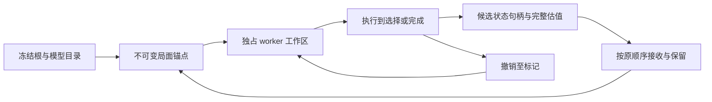

# 新一轮大幅重构调研（2026-09-10）

[性能目录](README.md) · [离线计算与源码定位](simulation-redesign-research-20260910.json) · [上一轮实测结果](simulation-refactor-result-20260910.md)

## 结论与研究范围

**值得尝试一次贯穿执行、分支存储和估值的内核原型。** 优先组合是：显式可恢复结算、紧凑的权威状态、worker 内撤销写入、候选的不可变状态句柄。单独更换字典、共享几个 Power、加普通转移缓存或换语言，没有现有证据支持 10×。

上一轮 P4 的约 2.70% 只约束首批三类 Power 的 Fork scope；它不测量全引擎数据表示改变后，访问、监听、指纹、执行和分配的合计变化。因此，“这几个类型不值得单独改”不能推出“整个状态内核没有重写价值”。同样，较大重写的收益目前也没有被测出来。本轮把进入条件改成能实际检验架构的完整纵向原型，而不是继续靠一个小容器代表整个方案。

本次检查 HEAD `6161e74`，其生产实现仍为 `1787f9d` 的回合检查点。工作包括定向源码阅读、已有完整 headless 原始日志的离线分析、已提交数据复算，以及外部一手资料核对。**没有新启动游戏、改变生产行为或产生新性能测量。** 沿用用户的 headless-only 要求；先前完成的计划仍是已完成的历史批次，本报告是新增研究建议。

## 当前证据能说明什么

从上一轮四个 B 样本重新计算，完整输入、VeryHigh / DOP8 / NoGC16GB 均保持原样：

| 当前保留实现的完整请求 | 机甲场景 | 亡灵场景 |
| --- | ---: | ---: |
| 逻辑转移 | 119,407 | 1,693,024 |
| 请求耗时均值 | 3.061 秒 | 76.702 秒 |
| 累计 worker 分配均值 | 4.871 GB | 85.376 GB |
| 分配 / 逻辑转移 | 40.79 KB | 50.43 KB |
| 请求耗时 / 逻辑转移 | 25.64 μs | 45.30 μs |

最后一行是 DOP8 的请求吞吐归一化，不能解释为一次动作的 CPU 或单线程延迟。转移可能包含复杂选牌、自动出牌或整段回合；不是 169 万次简单减血。分配是累计产生的对象字节，也不是每个存活局面必须占 50 KB。它仍提示应当测量每个分支的完整数据通路，而不只比较伤害公式的运算量。

原 `a6bc386` 的互斥搜索 CPU 采样中，亡灵的模拟/回放/Fork 合计约 59.33%，Snapshot 约 28.25%，两者合计约 87.58%；机甲约 61.74% + 24.43% = 86.17%。这是改造范围的依据，**不是当前版本的墙钟分解，更不是可以全部删除的开销**。P5 后的线程 CPU 诊断仍测到较大 Snapshot 成本；不同版本、分母、插桩方式不能直接相加。原始口径见[完整采样](simulation-profile-20260910.md)与[P2/P4 诊断](simulation-refactor-p2-p4-decision-20260910.md)。

## 一、优先方案：让执行器能从真正的选择点继续

当前 [ReplayPendingChoiceBranch](../../src/Search/CombatBeamSolver.Expansion.cs)调用 `ReplayAction(parent, action)`，从稳定父快照执行携带已选选项的动作。普通生产回放是单动作增量执行，**并非每次都从战斗根重放整条路线**。但同一动作出现不同或嵌套选择时，其付款、前置 Hook、抽牌或自动牌的共同部分仍可能重复执行。

已有 P5 只共享直接 EndTurn 中已完成的玩家回合末和敌方阶段。其余的卡牌执行、抽牌、Power 应用、死亡处理等仍受严格 Fork 禁令约束：[Simulator](../../src/Engine/InCombat/Simulation/CombatPredictionSimulator.cs)和[领域 Fork](../../src/Search/SimulatedCombatState.Fork.cs)只允许已定义的稳定边界。这些禁令保护了尚未显式存储的调用栈和局部变量，不能直接删掉。

目标是把结算控制流也变成可拥有、可复制的数据：

| 新内核内容 | 必须保存的状态 |
| --- | --- |
| 执行帧 | 语义操作编号、执行位置、已计算操作数、父帧返回位置 |
| 正在遍历的 Hook | 已捕获成员的顺序、当前位置、逐实例句柄；调用时读取当前数量 |
| 卡牌/抽牌/自动牌 | 当前卡实例、费用已支付状态、重播计数、抽牌深度及子调用位置 |
| Power/死亡事务 | 未完成的数量变化、来源、applier/target、待执行步骤、已处理死亡 |
| 选择 | 选择机制与稳定选项身份、当前选择序号、继续位置；额度仍由原 Search 顺序消费 |
| RNG 与历史 | 九路完整 RNG、历史长度和新增内容、终局戳及相关分支计数 |

执行到 `NeedChoice` 时冻结“紧凑状态＋执行帧”；不同选择只运行剩余结算。选择嵌套时再次冻结帧栈。`NeedChoice` 与 `Completed` 是不同结果类型，未完成的效果不能带假评分或假状态键进入 Beam。失败、取消和释放也必须按帧栈结束所有权。

这里借鉴的是把挂起局部状态放入显式 frame 的方式：[LLVM coroutine 文档](https://www.llvm.org/docs/Coroutines.html)描述了挂起帧、执行位置和 resume/destroy。对本项目的建议是实现受控的值型帧；文档没有保证一般协程帧可以克隆。C# `Task`、闭包或 `IEnumerator` 不能直接当成可供多个搜索分支共享的续执行状态。

**收益边界：** P5 前“首个消费选择之前”的成本估计为亡灵约 12.00%、机甲约 22.34% 请求 CPU，且其中已有一部分被 P5 覆盖。不能把全部 102 万选择分支算成重复前缀，也不能把首层、嵌套层的前缀重复相加。通用续执行单独没有 10× 证据；它的额外价值在于使下面的撤销执行可行。

## 二、与续执行配套：紧凑权威状态＋撤销日志＋Beam 状态句柄

当前已有卡牌 Preview COW、牌堆指纹缓存、不可变历史前缀和多种 Forkable 容器；这些不作为新增方案。剩余结构可从 [SimCardPile.Fork](../../src/Engine/Common/SimCardPile.cs)、[PredictedCard.Fork](../../src/Engine/Common/PredictedCard.cs)及[Simulator.Fork](../../src/Engine/InCombat/Simulation/CombatPredictionSimulator.cs)看到：每个分支仍创建包装和基础状态、登记对象映射、复制 Power/状态仓库等。

需要迁移的是权威表示：

- 主线程根捕获后，把类型、静态定义、显示元数据留在不可变目录；分支只保存 `CreatureId / CardInstanceId / PowerInstanceId` 等稳定句柄和实际可变字段。身份还要包含防止删除后重用混淆的代次。保持原牌堆和监听顺序，不能把 Model ID 当作逐实例身份。
- 牌、Power、RNG、隐藏状态和领域计数由一个值型存储拥有；卡牌和 Power 的读写经该存储完成。保留精确 decimal、舍入、枚举 getter 和自定义语义，不能为了数组化近似数值。`PredictionStateStore.GetReadOnly` 当前仍可能创建并返回可变状态，旧的可变对象借用必须先封住。
- 每个现有 worker lane 独占可变工作区。执行前记 undo 标记，写入记录原值/容器位置/长度；生成候选后冻结其状态差量和估值，再撤销至标记，继续同一父节点的下一个作业。记录新增实例、移除再获得、顺序变化及 RNG；所有异常和取消路径也要恢复或销毁该工作区。
- Beam 同时保存许多候选，不能照搬单栈 DFS。所有已发布候选都要拥有不可变状态句柄；用分块值数组或锚点＋差量表达，不把 lane 的 mutable 指针交给 coordinator。控制差量链深度并按实际还原成本物化，队列数量上限不能冒充字节上限。Prune 后回收无引用的数据块，保留原序仲裁及后续父链所需标量。

[Stockfish 的 Position 实现](https://github.com/official-stockfish/Stockfish/blob/master/src/position.cpp)使用 `do_move / undo_move` 与 `StateInfo` 保存恢复信息；[OpenSpiel State 接口](https://github.com/google-deepmind/open_spiel/blob/master/open_spiel/spiel.h)也区分 Clone、ApplyAction 和可选的 UndoAction。这些是设计参考，不能将棋类引擎的吞吐直接换算成带 Mod、自动牌和隐藏生命周期的战斗速度。

新方案与失败的“小型 COW 字典”不同：后者保留了整条对象图和借用 API，只减少少数容器分配。本方案同时改变状态访问、分支创建、执行继续与候选存储。不能让新数组和旧 Model 各自可写、每步双向同步；那会增加开销并产生两个权威状态。

迁移期按明确的语义能力闭包选择整次求解的后端。受支持的效果只能有一个生产语义实现，可从同一描述生成执行路径；测试允许旧引擎与原生实际执行作为 oracle。未迁移的已支持效果继续使用原后端；未知效果仍显式报告。新生成卡、召唤、第三方 subscriber、附着模型及补丁都在能力闭包内，不能只检查开局手牌，也不能运行到一半遇见未知效果后静默跳过或混接对象图。

**还缺的直接数据：** 每次真实转移改了多少字段/数组块、同一 lane 能共享多少父状态、冻结/还原成本、候选保留后的存活块数及完整效果闭包的覆盖率。此前 Power 借用计数不回答这些问题。本轮没有将估算的紧凑状态字节数写成实测。

## 三、增量估值值得配套做，但状态键有额外语义

[Snapshot](../../src/Search/CombatBeamSolver.StateEvaluation.cs)每次构造战斗键、多个牌堆派生键、投影洗牌、威胁和策略特征。全局局面每次变化，不表示每个局部特征都变化；因此低“整局缓存”命中率不能否定按准确依赖维护局部摘要。

受控写入口可以记录变化集合：生命/阵容更新敌人摘要，手牌/费用更新可执行资源，Power 数量/动态变量更新对应语义摘要，牌堆与 RNG 更新真正依赖它们的组件。保留原估值公式、顺序和物化边界，先审计依赖；全局 Hook 或不透明第三方字段无法证明依赖时必须完整重算。已经失败的“延迟手牌评分”把计算挪到消费阶段，本方案不依赖把可变模拟器留给下游懒读。

但不能直接把全局键改成 Zobrist 后就声称等价：[StateFingerprintBuilder](../../src/Search/StateFingerprint.cs)目前是两条顺序混合链；本轮找到 **22 处直接引用 StateKey 两部分作排序的源码行**，包括 [FinalPlanOrdering](../../src/Search/CombatBeamSolver.FinalPlanOrdering.cs)和 [BeamRetentionPolicy](../../src/Search/CombatBeamSolver.BeamRetentionPolicy.cs)。这不是 22 个独立比较器，但足以证明指纹数值参与选择结果。

迁移有两个边界明确的选择：

1. 保留旧 `StateKey` 值和现有排序，先只增量维护可独立缓存的摘要。收益要扣除仍需生成旧键的成本。
2. 用新的增量键仅作内部查找，碰撞核对完整语义；旧键继续用于原同分排序，并在需要前从不可变候选物化。若最终要移除旧键排序，须作为单独的搜索政策变化审查，不能计入“原路线、原预算完全相同”的后端实验。

[Zobrist 原始论文的大学存档](https://minds.wisc.edu/items/992e8337-5597-4a51-89d3-3fbe3559201a)提供状态哈希方法的出处，但并不替本项目证明状态字段完备或排序不变。牌的顺序、重复实例、RNG、过去动作对未来的影响和执行位置都必须按实际用途纳入；不能用无序牌堆哈希代替有序局面。

## 四、六次搜索可以重新组织，但普通共享缓存排在后面

对本次保留版亡灵 `43544da114824e169031be158500422d` 的完整日志与 [Coordinator](../../src/Search/CombatSearchCoordinator.cs)调用链交叉核对：1 次主搜索、1 次无药审计、2 次单个开局药水后续搜索、2 次双药开局后续搜索，共 6 次。日志中的两个双药后续结果均未替换主结果。所选 solver 409,290 次转移；完整请求 1,693,024 次，额外 1,283,734 次占 75.82%。

**75.82% 不等于无用或可消除的工作。** 审计改变药水约束、固定前缀与候选分布，它是当前质量政策的一部分。日志没有所有转移键，无法由这些数算出六次搜索之间的重复率。

而且[历史探针](veryhigh-state-experiments-20260908.md)已经覆盖一个完整 coordinator：618,785 次可缓存尝试中仅 15,563 次重复，约 2.52%，键包含父状态、完整动作和父动作数。虽然输入/版本较旧、键可能保守，它是反对“直接加大缓存就能翻倍”的实际证据，不能因为本轮发现 6 次 solver 就忽略。

较大的后续选项是把确定的语义转移图与各搜索的政策账本分开：只共享不可变语义结果；Beam、循环、选择额度、固定前缀资格和药水约束仍各自运行。命中也必须按原逻辑消费预算与原序提交，不能把一个 solver 的保留决定搬给另一个。如果进一步让多政策共用一次图展开，则要证明每个原搜索都会生成/准入哪些节点，不能拿一个宽 Beam 代替六个不等价的搜索。

暂不优先实现。先在新权威状态上定义完备的语义转移键，再量一次覆盖全部 solver 的有界缓存净收益和存活字节；不能仅删除父动作数、历史或药水上下文以提高命中。低命中时继续做执行/数据表示，不重启旧缓存实验。

## 五、动作顺序约简：可能减少数量，证明难度最高

若两步动作互不改变对方的合法性，并且交换后完整状态、历史、后续可观察行为一致，可以避免探索重复排列。[Flanagan / Godefroid 的 DPOR 原论文](https://users.soe.ucsc.edu/~cormac/papers/popl05.pdf)给出了基于依赖关系减少等价交错的思路；它研究并发程序可达性，本项目的质量排序与有限 Beam 需要额外证明。

本游戏中，两张“普通攻击牌”也会共同写入能量、出牌历史、牌堆顺序，触发遗物、Power、死亡与 RNG；不能按卡牌类型推定可交换。即使最终 HP 相同，中间牌序、触发次数和合法后缀可能不同。动态读写集合只能提供证明的部分输入，不是通用安全判定。

进一步，即使两条完整路线在战斗语义上等价，删除其中一个前缀也可能改变有限 Beam 的排序、配额、循环资格与预算分布。若承诺保持本轮质量合同，必须保留这些调度语义或单独验证政策改变。现有同牌去重、转置与循环机制也要纳入，不能把已消除的排列再次计作新收益。

因此该方向排在受控状态和执行内核之后；先离线统计可证明独立的操作对及被重复枚举的排列比例。循环快进、宏动作和更强下界同样需要各自的闭包/奖励/中间事件证明，目前没有全局 10× 证据。

## 10× 的条件与建议推进顺序

仅用 `S = 1 / ((1-p) + p/k)` 作敏感性计算：若可改造部分占 90%，该部分快 10×，整体约 5.26×；若占 95%，快 10×，整体约 6.90×；占 95% 且快 20×，整体才约 10.26×。这里的 p/k 是**假设**，没有把旧 on-CPU 百分比或不同实验的收益相乘来预测墙钟。

这意味着 10× 要么来自几乎整个热路径的表示/执行改变，要么还要减少实际重复工作；仅省 Fork 或 PendingChoice Snapshot 不够。更换 C++/Rust、GPU、SIMD、更多线程或扩大 NoGC 都不自动改变这个条件。Mirror registry 当前已经缓存类型解析并调用类型化 handler，并不是每次反射调用；其 inclusive CPU 包含真实效果，不能全部视为分发开销。先把紧凑内核放在现有 C# 中验证，只有 JIT/布局证据支持时再考虑语言迁移。

| 顺序 | 要产出的具体证据 | 进入下一步的条件 |
| --- | --- | --- |
| R0：状态/执行边界 | 权威字段和写入口清单；逐实例句柄；挂起帧、RNG、历史与取消合同；测量真实写入密度与跨选择前缀工作，枚举支持效果闭包 | 没有新旧状态双写，也没有绕过未完成事务的普通 Fork；按实际写入而非借用次数决定日志/块大小 |
| R1：完整纵向原型 | 一个真实的多选择动作链，包含付款、Hook、抽牌/自动牌、嵌套选择、候选估值/冻结/撤销；能力按语义登记 | 与旧引擎及原生相关最小差分一致；不能只测纯数组伤害循环 |
| R2：原型成本 | 固定相同父节点和全部选择，测 CPU、分配、状态还原、旧键生成、冻结与保留成本 | 建议研究门槛：完整代表展开至少 3×，分配降至 ≤20%；这是目标，不是测量结果或全局预测 |
| R3：覆盖与搜索接线 | 扩大到两份原完整输入及其动态效果闭包，保留独立政策账本和原排序；比较 DOP1/DOP2 及取消/失败排空 | 所有支持路径都有明确后端归属；全量语义与原逻辑工作合同一致 |
| R4：正常完整 A/B | 新冻结候选对当前 P5；原完整 VeryHigh/DOP8/16GB、相同预热、预先固定交错顺序、每请求120秒 | 比较整场路线/战损、逻辑与物理工作、分配、峰值RSS和GC；最终完整 headless 部署、零计划外重算 |
| 可选算法分支 | 新状态上的跨搜索命中率或可交换动作比例 | 有独立收益和正确性证据才接入；不提前与内核提速相乘 |

建议先投入 R0–R2，原型必须从一开始穿过“执行到选择→恢复→估值→冻结→撤销”的完整链。这样才能回答大幅重写是否值得，而不是再次用一个占比很小的 Power 或容器代表整个引擎。原型达不到门槛时应定位哪一段仍在复制/转换；不靠缩牌组、降搜索质量或删除审计来达标。

## 本轮验证与未验证项

本轮只执行 L0：离线脚本从已提交 P5 数据重算四个 B 样本的均值/归一化值，提取同次亡灵日志的审计事件，与源码核对 6 次 solver；源码扫描记录 22 处状态键排序行；检查新增 JSON、Markdown 相对链接及差异格式。原始日志和辅助脚本位于本地研究目录，不提交完整日志。

未运行新构建、行为测试、headless 或可见游戏；没有新的 CPU/写密度采样、通用 continuation、undo 内核或增量估值实现。参考资料于 2026-09-10 核对，用于设计依据，不提供本项目的加速保证。
